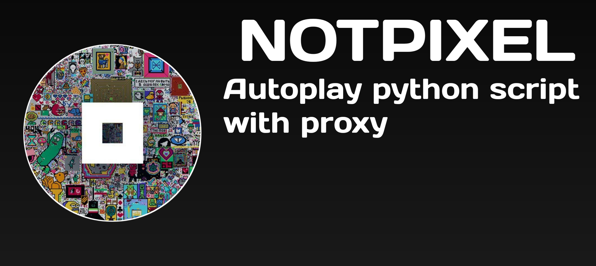

<div align="center">
  
</div>

# NotPixel
Introducing the [NotPixel Bot](https://t.me/notpixel/app?startapp=f5760224255_s4): 

a fully automatic tool for claiming and painting. With built-in anti-detection features, it works efficiently and discreetly to get the best results. Simplify your tasks with the NotPixel Bot!

## Features:
* 🌵 Automatic Boosting 
* 👾 Multi-Session
* 🔥 Multi-Thread 
* ⭕️ Error handling 
* ✍🏻 Draw with desired x,y
* 💰 Claim Mining
* 💰 Paint Pixel
* 💸 Show user balance
* 🤖 Anti detect
* 🐍 easy to use as module

## Quick Installation

To easy install libraries and run bot just open run.bat on Windows and edit .env file

## Usage

1. Install the required libraries:
   ```bash
   $ python3 -m pip install -r requirements.txt
   ```
2. Insert  your API Hash and API ID, which can be obtained from my.telegram.org under the Development section in main.py

Then just run it!
```bash
$ python3 main.py
```

## Manual installation 

Clone repository and change directory 

```
git clone https://github.com/zyz-airdrops/notpixel-claimer.git
```
```
cd notpixel-claimer
```
Install the required libraries:

```
 python -m pip install -r requirements.txt
```
Run the script:
```
python main.py
```
